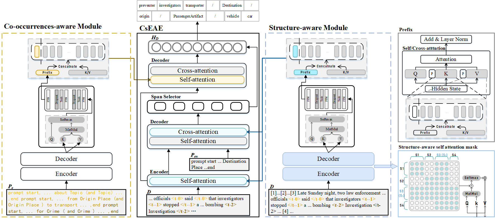

This is the implementation of the paper [One Small and One Large for Document-level Event Argument Extraction](https://arxiv.org/pdf/2411.05895)


## Quick links

* [Overview](#overview)
* [Preparation](#preparation)
  * [Environment](#environment)
  * [Data](#data)
* [Run the model](#run-the-model)
  * [Quick start](#quick-start)
* [Acknowledgments](#acknowledgments)
* [Citation](#citation)
--- 
## Overview

In this work we present CsEAE and CsLLMs for document-level event argument extraction. 

We formulate highlights of CsEAE as follow:

<p align="center" width="100%">

</p>

- Multiple-event prompts aid in enhancing the model's performance when dealing with complex event relationships.
- Constructing structured information by limiting the receptive field can alleviate the interference of redundant information.
- The prefix-based approach can integrate various auxiliary perceptual information.

We formulate contributions of CsLLMs as follow:

<p align="center" width="100%">

</p>
<!-- <p align="center" width="100%">

</p> -->

- We designed different prompts for various datasets and further used SFT to enhance the performance of LLMs. 
- We proposed multiple datasets SFT and supplementary dataset enhancement training, which led to even better performance.
- We applied insights from SLMs to LLMs, resulting in further performance improvements. This shows that reliable insights validated on SLMs are also effective for LLMs.
--- 
## Preparation

### Environment
Please download the required dependencies as described in the README file of CsEAE.

All experiments run with BART_Large, You can install from [Huggingface](https://huggingface.co/facebook/bart-large).

Please download the required dependencies as described in the README file of CsLLMs.

You can install the LLMs of Open-source from [Huggingface](https://huggingface.co/collections/meta-llama/meta-llama-3-66214712577ca38149ebb2b6).

### Data
We conduct experiments on three commonly used datasets: **RAMS**, **WikiEvents**, and **MLEE**.

We used the data preprocessing method from [TabEAE](https://github.com/Stardust-hyx/TabEAE). For details, please refer to the TabEAE repository. 

If you find the preprocessing steps too complicated, feel free to email me directly for the preprocessed data (except for ACE, as it is not free). 

Thanks to the creators of these datasets for making their work available!

---

## Run the Model

### Quick Start
For detailed usage and additional information, please refer to the documentation of **CsEAE** or **CsLLMs**.

### LLMs

We have preserved all the parameters related to the LLMs mentioned in the paper. If needed, please do not hesitate to contact me.
```bibtex
meta-llama3-8B- data in [ACE, RAMS, WikiEvents, MLEE, GENEVA]

meta-llama3-8B-instructed- data in [ACE, RAMS, WikiEvents, MLEE, GENEVA]

meta-llama3-8B-csllms- data in [RAMS, WikiEvents, MLEE]

llama-3-8B-instructed-ace-wiki-rams

llama-3-8B-instructed-ace-wiki-rams-geneva

llama-3-8B-instructed-ace-wiki-rams-mlee

llama-3-8B-instructed-wiki-rams-mlee

llama-3-8B-instructed-csllms-wiki-rams-mlee

llama-3-8B-instructed-ace-wiki-rams-mlee-geneva

llama-3-8B-instructed-csllms-ace-wiki-rams-mlee-geneva
```
---
## Acknowledgments
We gratefully acknowledge the contributions of Yubo Ma, I-Hung Hsu and Yuxin He for their foundational code and data preprocessing methods.


Many thanks to [Yubo Ma](https://mayubo2333.github.io/) for the open-source projects [LLM-IE](https://github.com/mayubo2333/LLM-IE) and [PAIE](https://github.com/mayubo2333/PAIE), which provided valuable code support and inspiration for this project.

Special thanks to [I-Hung Hsu](https://ihungalexhsu.github.io/) for the open-source project [AMPERE](https://github.com/PlusLabNLP/AMPERE), which contributed valuable code support and inspiration for this project.

Many thanks to [Yuxin He](https://stardust-hyx.github.io/) for the open-source project [TabEAE](https://github.com/Stardust-hyx/TabEAE), which also provided valuable code support and inspiration for this project.


--- 
## Citation
Please cite our paper if you use CsEAE or CsLLMs in your work:
```bibtex
@misc{peng2024smalllargedocumentlevelevent,
      title={One Small and One Large for Document-level Event Argument Extraction}, 
      author={Jiaren Peng and Hongda Sun and Wenzhong Yang and Fuyuan Wei and Liang He and Liejun Wang},
      year={2024},
      eprint={2411.05895},
      archivePrefix={arXiv},
      primaryClass={cs.CL},
      url={https://arxiv.org/abs/2411.05895}, 
}
```
